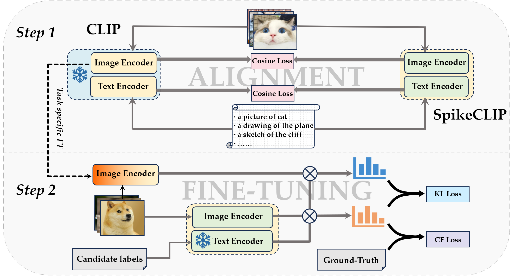
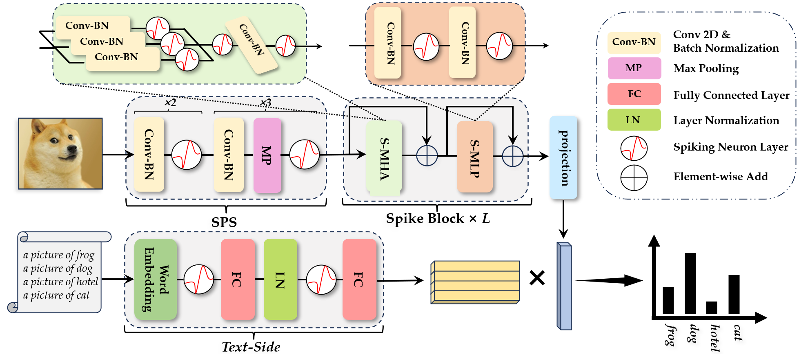

# SpikeCLIP: A Contrastive Language-Image Pretrained Spiking Neural Network

Accepted by Neural Network, Volume 188, 107475, 2025.08.

https://www.sciencedirect.com/science/article/abs/pii/S0893608025003545

## The following is the process of "Alignment Pre-training + Dula Loss Fine-tuning" for training SpikeCLIP.



## The following is the architecture diagram of SpikeCLIP




## Install Requirements

```shell
conda create -n snn python=3.8
conda activate snn
pip install -r requirements.txt
```

## Training a Text Encoder for SpikeCLIP

```shell
cd language
bash alignment_text.sh
```

## Alignment Pre-training the image encoder of SpikeCLIP

```shell
cd vision/alignment_ft
bash bash/alignment.sh
```

## Task specific fine-tuning of CLIP

```shell
cd vision/task_ft_CLIP
bash bash/alignment.sh
```

## Dual-Loss FT the image encoder of SpikeCLIP

```shell
cd vision/alignment_ft
bash bash/pretrain_{dataset_name}.sh
bash bash/finetune_{dataset_name}.sh
```


## Conduct experiments on w/o LSD

```shell
cd vision/no_LSD
bash bash/{dataset_name}.sh
```


## Notes

- You can download and construct all the required datasets through clip_eval.py.
- Shell commands above only show how to run the program.
- Detailed hyperparameters can be set as needed.
